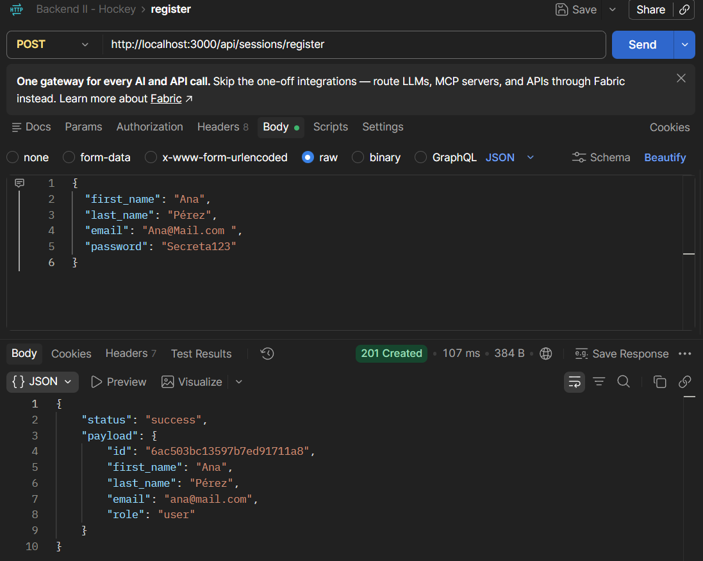
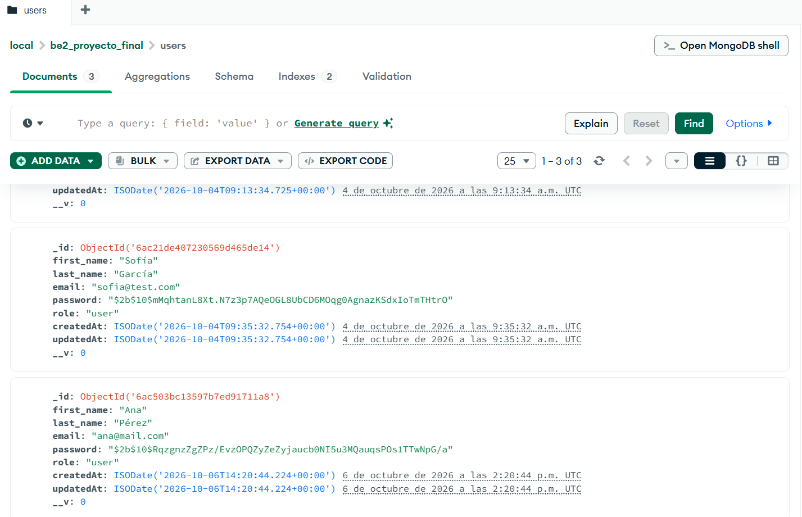

# Plataforma de Torneos y Clínicas de Hockey

Proyecto final de Backend II (Coderhouse). API REST para gestionar torneos y clínicas de hockey sobre césped: usuarios, eventos, categorías e inscripciones.

Esta versión corresponde a la **Pre-entrega 2**: suma el **registro seguro de usuarios** (`POST /api/sessions/register`) sobre la base por capas de la Pre-entrega 1, con validaciones, normalización del email, contraseña hasheada con bcrypt y respuestas sin datos sensibles.

## Temática

La plataforma permite que clubes y entrenadores publiquen **torneos** y **clínicas técnicas** de hockey, y que los jugadores se inscriban.

| Rol | Quién es | Qué va a poder hacer |
| --- | --- | --- |
| `admin` | Administración de la plataforma | Gestionar usuarios, categorías, eventos e inscripciones |
| `organizer` | Club, entrenador o academia | Crear y administrar sus torneos y clínicas |
| `user` | Jugador o jugadora | Consultar eventos e inscribirse |

Todo usuario nuevo se registra con rol `user`. El rol nunca se toma del body del registro.

### Entidades

| Modelo | Qué representa |
| --- | --- |
| `User` | Usuario de la plataforma: `first_name`, `last_name`, `email` (único), `password` (hash) y `role` (`user` por defecto; `user`, `organizer` o `admin`) |
| `Event` | Torneo o clínica: nombre, tipo (`torneo` / `clinica`), fecha, lugar, cupo, precio, estado, categoría y organizador |
| `Category` | Categoría de los eventos (por ejemplo Sub 14, Sub 16, Primera, Arqueras) |
| `Registration` | Inscripción de un usuario a un evento. Un usuario no puede inscribirse dos veces al mismo evento |

## Tecnologías

- Node.js
- Express
- MongoDB + Mongoose
- dotenv
- bcrypt (hash de contraseñas)
- Módulos ESM (`import` / `export`)

Próximas entregas: JWT, cookie-parser, Passport y Nodemailer.

## Instalación

```bash
git clone https://github.com/RaulAlvarezV/be2_proyecto_final.git
cd be2_proyecto_final
npm install
```

## Variables de entorno

Copiar `.env.example` como `.env` y completar los valores:

```
PORT=8080
NODE_ENV=development
MONGO_URL=mongodb://localhost:27017/be2_proyecto_final
JWT_SECRET=
```

| Variable | Descripción |
| --- | --- |
| `PORT` | Puerto del servidor (por defecto 8080) |
| `NODE_ENV` | Entorno de ejecución (`development` / `production`) |
| `MONGO_URL` | Cadena de conexión a MongoDB (local o Atlas) |
| `JWT_SECRET` | Clave para firmar los tokens (se usa a partir de la próxima entrega) |

El archivo `.env` no se sube al repositorio.

## Ejecución

```bash
# desarrollo (se reinicia al guardar cambios)
npm run dev

# producción
npm start
```

## Estructura de carpetas

```
src/
├── app.js              # configura Express (middlewares y rutas), no levanta el servidor
├── server.js           # levanta el servidor y conecta la base de datos
├── config/
│   ├── env.js          # lectura de variables de entorno con dotenv
│   └── db.js           # conexión a MongoDB
├── routes/
│   ├── health.router.js
│   ├── events.router.js
│   └── sessions.router.js
├── controllers/
│   ├── health.controller.js
│   ├── events.controller.js
│   └── sessions.controller.js
├── services/
│   ├── events.service.js
│   └── sessions.service.js     # validaciones y lógica del registro
├── repositories/
│   ├── events.repository.js
│   └── users.repository.js
├── dao/
│   ├── events.dao.js
│   └── users.dao.js
├── models/
│   ├── User.js
│   ├── Event.js
│   ├── Category.js
│   └── Registration.js
├── middlewares/
│   └── error.middleware.js     # rutas no encontradas y manejo global de errores
└── utils/
    ├── hash.js                 # bcrypt reutilizable: createHash e isValidPassword
    └── errors.js               # error con código de estado (AppError)
```

Flujo del registro:

```
POST /api/sessions/register
  → sessions.router.js       (define el endpoint)
  → sessions.controller.js   (recibe la request y responde)
  → sessions.service.js      (valida, normaliza, controla duplicados, hashea)
  → users.repository.js      (operaciones de datos)
  → users.dao.js             (Mongoose)
  → User.js                  (modelo)
  → MongoDB
```

## Registro de usuarios

### `POST /api/sessions/register`

**Campos que espera el body (JSON):**

| Campo | Tipo | Obligatorio | Reglas |
| --- | --- | --- | --- |
| `first_name` | texto | Sí | No puede estar vacío |
| `last_name` | texto | Sí | No puede estar vacío |
| `email` | texto | Sí | Formato válido. Se guarda sin espacios y en minúsculas. No puede repetirse |
| `password` | texto | Sí | Mínimo 8 caracteres. Se guarda hasheada con bcrypt |

Si el body incluye `role`, se ignora: todo registro público se crea con rol `user`.

**Request:**

```json
{
  "first_name": "Ana",
  "last_name": "Pérez",
  "email": "Ana@Mail.com ",
  "password": "Secreta123"
}
```

**Respuestas:**

`201` (email normalizado, sin contraseña):

```json
{
  "status": "success",
  "payload": {
    "id": "665f2a...",
    "first_name": "Ana",
    "last_name": "Pérez",
    "email": "ana@mail.com",
    "role": "user"
  }
}
```

`400` (campos faltantes):

```json
{ "status": "error", "message": "Faltan campos obligatorios" }
```

| Código | Mensaje | Cuándo |
| --- | --- | --- |
| `400` | `Faltan campos obligatorios` | Falta `first_name`, `last_name`, `email` o `password` |
| `400` | `Formato de email inválido` | El email no tiene formato válido (por ejemplo `anamail.com`) |
| `400` | `La contraseña debe tener al menos 8 caracteres` | Contraseña demasiado corta |
| `400` | `Los campos deben ser texto` | Algún campo no es texto (por ejemplo un número) |
| `400` | `El nombre y el apellido no pueden estar vacíos` | Nombre o apellido con solo espacios |
| `400` | `El cuerpo de la petición no es un JSON válido` | El body está mal formado |
| `409` | `El email ya está registrado` | Ya existe un usuario con ese email (aunque venga con mayúsculas o espacios) |

### Cómo probarlo

1. Levantar el servidor con `npm run dev`.
2. En **Postman** (o Insomnia) crear una request **POST** a `http://localhost:8080/api/sessions/register`.
3. En **Body** elegir **raw** → **JSON** y pegar el ejemplo de arriba. Enviar: responde `201`.
4. Volver a enviar la misma request: responde `409` (email ya registrado).
5. Borrar `first_name` del body y enviar: responde `400` (faltan campos obligatorios).
6. Cambiar el email por `anamail.com`: responde `400` (formato de email inválido).

También con curl:

```bash
curl -X POST http://localhost:8080/api/sessions/register -H "Content-Type: application/json" -d "{\"first_name\":\"Ana\",\"last_name\":\"Pérez\",\"email\":\"Ana@Mail.com \",\"password\":\"Secreta123\"}"
```

### Cómo verificar que la contraseña está protegida

- **En la respuesta:** el `payload` solo tiene `id`, `first_name`, `last_name`, `email` y `role`. No aparece `password` (ni en texto plano ni hasheada).
- **En la base:** en MongoDB Compass, abrir la base `be2_proyecto_final` → colección `users`. El campo `password` empieza con `$2b$10$...`: es el hash de bcrypt, no la contraseña original.

### Evidencias

**Registro exitoso en Postman:** el email llega como `"Ana@Mail.com "` y se guarda normalizado como `ana@mail.com`, con rol `user`. La respuesta no incluye la contraseña.



**Usuario guardado en MongoDB Compass:** el mismo usuario (`_id` `6ac503bc13597b7ed91711a8`, igual al `id` de la respuesta) tiene la contraseña hasheada con bcrypt (`$2b$10$...`), nunca en texto plano.



## Rutas disponibles

| Método | Ruta | Descripción | Estado |
| --- | --- | --- | --- |
| GET | `/api/health` | Verifica que el servidor esté activo | Disponible |
| GET | `/api/events` | Lista de torneos y clínicas | Disponible |
| POST | `/api/sessions/register` | Registro seguro de usuario | **Disponible** |
| POST | `/api/sessions/login` | Inicio de sesión | Próxima entrega (responde 501) |
| GET | `/api/sessions/current` | Usuario logueado | Próxima entrega (responde 501) |
| POST | `/api/sessions/logout` | Cierre de sesión | Próxima entrega (responde 501) |

### Otros ejemplos

`GET /api/health` → `200`

```json
{ "status": "ok", "message": "Servidor activo" }
```

`GET /api/events` → `200` (lista vacía al inicio)

```json
{ "status": "success", "payload": [] }
```

Ruta inexistente → `404`

```json
{ "status": "error", "message": "Ruta no encontrada" }
```
